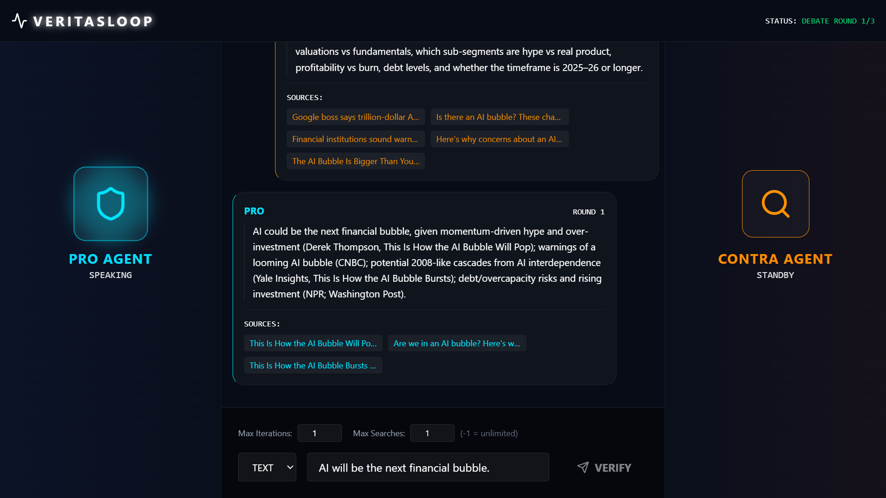

# VeritasLoop

<div align="center">

**A Multi-Agent News Verification System Through Adversarial Debate**

[](https://www.python.org/downloads/)
[](LICENSE)
[](https://github.com/langchain-ai/langchain)
[](https://github.com/langchain-ai/langgraph)

[Features](#-key-features) • [Installation](docs/INSTALLATION.md) • [Quick Start](#-quick-start) • [Documentation](#-documentation) • [Architecture](docs/ARCHITECTURE.md)

</div>

---

## 📢 Latest Updates

**Version 0.4.0 - December 2025 - Production Ready 🚀**
- 🔒 **Enterprise-Grade Security**: CORS configuration, input validation, URL sanitization, error message sanitization
- ⚡ **Enhanced Stability**: HTTP timeouts, LLM error handling, WebSocket reconnection, cache size limits
- ♿ **Accessibility First**: ARIA attributes, keyboard navigation, screen reader support
- 🛡️ **Rate Limiting**: Protection against abuse with configurable request limits (10/minute default)
- ⏱️ **Smart Timeouts**: 5-minute automatic timeout for long-running verifications
- 📊 **Environment Validation**: Startup checks ensure all required API keys are configured
- 🎨 **Loading States**: Skeleton loaders and smooth transitions for better UX
- 🔧 **Centralized Configuration**: Environment-based settings for backend and frontend
- 📝 **Structured Logging**: Production-ready logging with proper log levels

**Version 0.3.0 - December 2025**
- 🎭 **Agent Personalities**: Select communication styles for PRO and CONTRA agents (Passive, Assertive, Aggressive)
- 👥 **Named Agents**: Each personality has a unique name (Oliver, Marcus, Victor, Sophie, Diana, Raven)
- 🎨 **Enhanced UI**: Visual personality selector with icons and real-time name display
- 💬 **Dynamic Tone**: Agents adapt their language and communication style based on selected personality
- ⚙️ **Configurable Debates**: Create unique debate dynamics by mixing different personalities

**Version 0.2.0 - December 2025**
- ✨ **New React Web UI**: Modern, professional single-page application with real-time WebSocket streaming
- 🚀 **FastAPI Backend**: High-performance API server with WebSocket support for real-time communication
- 🎨 **Glassmorphism Design**: Cyber-courtroom aesthetic with smooth animations and visual effects
- 🔄 **Real-Time Updates**: Live agent status indicators and progressive message rendering
- ⚙️ **Configurable Parameters**: Adjust max iterations and max searches directly from the UI
- 📱 **Responsive Design**: Optimized for desktop and tablet devices
- 🎭 **Dramatic Verdict Reveal**: Full-screen modal with color-coded results and detailed analysis
- 🔧 **Developer Experience**: Hot Module Replacement (HMR) for instant development feedback

**Previous Releases:**
- Version 0.1.0 - Streamlit web UI, CLI interface, and core multi-agent system

---

<div align="center">



*The modern React-based web interface with real-time WebSocket streaming and cyber-courtroom aesthetic*

</div>

---

## Overview

**VeritasLoop** is an advanced adversarial multi-agent system that verifies news authenticity through structured dialectical debate. Rather than relying on traditional single-pass fact-checking, VeritasLoop simulates a courtroom scenario where:

- **PRO Agent** 🛡️: An institutional analyst that defends claims using authoritative sources (government, academic, major news)
- **CONTRA Agent** 🔍: A skeptical investigator that challenges claims, identifying contradictions and missing context
- **JUDGE Agent** ⚖️: An impartial evaluator that analyzes the full debate and delivers a nuanced, structured verdict

This adversarial approach reduces confirmation bias, exposes conflicting evidence transparently, and produces nuanced verdicts in **five categories** rather than simple true/false labels.

### Agent Personalities

Each PRO and CONTRA agent can adopt one of three distinct communication styles, allowing you to customize the debate dynamics:

**PRO Agent (Defender) Personalities:**
- 😌 **Oliver (Passive)**: Cautious and tentative, uses phrases like "it seems", "perhaps", "possibly"
- 💪 **Marcus (Assertive)**: Confident and persuasive, fact-based and balanced *(default)*
- 🔥 **Victor (Aggressive)**: Forceful and confrontational, uses strong rhetoric and emotional appeals

**CONTRA Agent (Skeptic) Personalities:**
- 😌 **Sophie (Passive)**: Polite and diplomatic, gentle questioning and respectful skepticism
- 💪 **Diana (Assertive)**: Professional and firm, thorough fact-checking *(default)*
- 🔥 **Raven (Aggressive)**: Harsh and relentless, uncompromising criticism and fierce challenges

The personality selection affects only the **tone and language style** of the agents' arguments, not their search strategies or evidence gathering. This allows for diverse debate dynamics, from polite academic discourse (Oliver vs Sophie) to intense confrontation (Victor vs Raven).

### Why VeritasLoop?

Traditional fact-checking suffers from several limitations:

- **Single-perspective bias**: One analyst may miss counter-evidence
- **Binary outcomes**: True/false labels miss important nuance
- **Black-box reasoning**: Users don't see the verification process
- **Limited source diversity**: Often relies on single databases

VeritasLoop addresses these through:

- **Adversarial validation**: Two opposing agents ensure balanced analysis
- **Transparent debate**: Full reasoning and sources exposed to users
- **Nuanced verdicts**: Five-category classification system (True, False, Partially True, Missing Context, Cannot Verify)
- **Multi-source verification**: Web search, news APIs, social sentiment, fact-check databases

---

## 🔒 Production Readiness

VeritasLoop is built with enterprise-grade security, stability, and accessibility features for public deployment:

### Security & Validation
- **🛡️ Input Validation**: Pydantic-based validation for all WebSocket messages and API inputs
- **🔗 URL Sanitization**: Comprehensive URL validation with protocol and length checks
- **🚫 CORS Protection**: Environment-configurable allowed origins (no wildcards in production)
- **🔐 Error Sanitization**: User-friendly error messages that don't leak internal details
- **⏱️ Request Timeouts**: 10-second timeout on all external HTTP requests to prevent hanging
- **🚦 Rate Limiting**: Configurable IP-based rate limiting (default: 10 requests/minute)

### Stability & Reliability
- **🔄 WebSocket Reconnection**: Automatic retry logic with exponential backoff (max 3 retries)
- **⏰ Verification Timeouts**: 5-minute automatic timeout for long-running verifications
- **🛡️ LLM Error Handling**: Graceful degradation when LLM calls fail
- **💾 Cache Size Limits**: LRU cache with 1000-entry limit prevents memory exhaustion
- **📊 Environment Validation**: Startup validation ensures all required API keys are configured
- **🔧 Frontend Error Boundary**: React error boundary prevents full app crashes

### User Experience & Accessibility
- **♿ ARIA Compliant**: Full ARIA attributes for screen readers and assistive technologies
- **⌨️ Keyboard Navigation**: Complete keyboard accessibility for all interactive elements
- **🎨 Loading States**: Skeleton loaders and smooth animations during verification
- **📱 Responsive Design**: Optimized for desktop, tablet, and mobile devices
- **🌐 Internationalization**: Italian and English language support

### Configuration & Monitoring
- **⚙️ Centralized Settings**: Pydantic-based settings management with environment variable support
- **📝 Structured Logging**: Production-ready logging with configurable log levels
- **🔍 Phoenix Tracing**: Optional observability with Arize Phoenix integration
- **📊 Performance Metrics**: Comprehensive tracking of cache hits, API calls, and processing time

---

## 🎯 Key Features

### Core Capabilities

- **🎭 Adversarial Multi-Agent Architecture**: Three specialized agents (PRO, CONTRA, JUDGE) working through LangGraph state orchestration
- **👥 Customizable Agent Personalities**: Choose from 3 communication styles per agent (Passive, Assertive, Aggressive) with unique names
- **🔄 Dialectical Debate Process**: Up to 3 rounds of structured argumentation with rebuttals and defenses
- **🎨 Nuanced Verdict System**: Five-category classification (True, False, Partially True, Missing Context, Cannot Verify)
- **📚 Multi-Source Verification**:
  - Brave Search API (primary web search)
  - DuckDuckGo (scraping fallback)
  - NewsAPI (news aggregation)
  - Reddit API via PRAW (social sentiment)
- **🔗 Flexible Input**: Supports both raw text claims and URL extraction
- **🇮🇹 Italian Language Support**: Native Italian output with comprehensive summaries
- **💾 Smart Caching**: 1-hour TTL cache to reduce redundant API calls
- **📊 Source Reliability Assessment**: Automatic classification (High/Medium/Low) based on domain authority

### User Interfaces

- **🎨 React Web UI** (Recommended): Modern, professional single-page application with real-time WebSocket streaming, smooth animations, and glassmorphism design
- **🖥️ Streamlit Web UI** (Legacy): Alternative interface with real-time debate streaming (maintained for compatibility)
- **⚡ Command-Line Interface**: Fast, scriptable verification with JSON export
- **🔧 Programmatic API**: Direct Python integration for custom workflows

### Observability & Debugging

- **🔍 Arize Phoenix Integration**: Visual tracing of agent interactions and LLM calls
- **📈 Performance Metrics**: Detailed tracking of API calls, cache performance, and timing
- **🗄️ Persistent Traces**: SQLite database storage for historical analysis
- **📊 Real-time Monitoring**: Watch agent reasoning and tool calls in action

---

## 🚀 Quick Start

### Web Interface (Recommended)

#### React Web UI (Modern SPA)

```bash
# Terminal 1: Start the FastAPI backend
uvicorn api.main:app --reload --port 8000

# Terminal 2: Start the React frontend
cd frontend
npm install  # Only needed the first time
npm run dev
```

Open **http://localhost:5173** to access the modern web interface with real-time updates.

**See [Usage Guide](docs/USAGE.md) for detailed instructions.**

#### Streamlit Web UI (Legacy)

```bash
# Option 1: Use launcher script
./launch_streamlit.sh  # Linux/Mac
launch_streamlit.bat   # Windows

# Option 2: Direct launch
streamlit run app.py
```

Open **http://localhost:8501** for the Streamlit interface.

### Command-Line Interface

```bash
# Verify a text claim
uv run python -m src.cli --input "L'ISTAT ha dichiarato che l'inflazione è al 5%"

# Verify a news article URL
uv run python -m src.cli --input "https://www.ansa.it/sito/notizie/..."

# Show detailed debate transcript
uv run python -m src.cli --input "..." --verbose

# Save results to JSON
uv run python -m src.cli --input "..." --output results.json

# Enable visual tracing with Phoenix
uv run python -m src.cli --input "..." --trace --verbose
```

---

## ⚙️ Configuration

Before running the application, you need to configure your API keys.

1.  Copy the example environment file:
    ```bash
    cp .env.example .env
    ```
2.  Edit the new `.env` file and add your secret keys.

> **⚠️ SECURITY WARNING**
> The `.env` file contains your secret API keys. **NEVER** commit this file to Git or share it publicly. The `.gitignore` file is already configured to ignore it, but you must ensure it remains private.

See the `.env.example` file for a full list of available options.

---

## Example Output

```
═════════════════════════════════════════════════════════════════
✅  VERDETTO: VERO
   Confidenza: 85%
═════════════════════════════════════════════════════════════════

📝 Sintesi:
La notizia riporta un dato reale confermato da fonti ufficiali dell'ISTAT.
Il tasso di inflazione del 5% corrisponde ai dati pubblicati nel rapporto
mensile di gennaio 2024...

📊 Analisi:
  Punti di forza PRO:
    • Fonti istituzionali autorevoli (ISTAT, Banca d'Italia)
    • Dati statistici verificabili e tracciabili
  ...

📚 Fonti Principali (8 verificate):
  [1] ISTAT - Inflazione Report Gennaio 2024
      https://www.istat.it/it/archivio/288969
      Affidabilità: Alta 🟢
  ...

⏱️  Metadata:
  • Tempo di elaborazione: 42.3 secondi
  • Round di dibattito: 2
  • Fonti totali analizzate: 23
```

---

## 📖 Documentation

### Core Documentation

- **[Installation Guide](docs/INSTALLATION.md)** - Complete installation and setup instructions
- **[Usage Guide](docs/USAGE.md)** - How to use all interfaces (Web, CLI, API)
- **[Architecture Overview](docs/ARCHITECTURE.md)** - Technical system design and data models
- **[React UI Guide](docs/REACT_UI.md)** - Modern web interface architecture
- **[Deployment Guide](docs/DEPLOYMENT.md)** - Production deployment strategies
- **[Development Guide](docs/DEVELOPMENT.md)** - Contributing and development workflows

### Additional Resources

- **[LOGGING.md](docs/LOGGING.md)** - Logging system documentation
- **[PLANNING.md](PLANNING.md)** - Project planning and roadmap
- **[TASK.md](TASK.md)** - Detailed task breakdown and status
- **[STREAMLIT_GUIDE.md](docs/STREAMLIT_GUIDE.md)** - Streamlit UI usage guide
- **[PHOENIX_ENHANCEMENT_SUMMARY.md](PHOENIX_ENHANCEMENT_SUMMARY.md)** - Phoenix integration details

### Quick Reference

#### Verdict Categories

| Verdict | Italian | Description |
|---------|---------|-------------|
| ✅ **TRUE** | `VERO` | Substantially accurate and supported by strong evidence |
| ❌ **FALSE** | `FALSO` | Demonstrably false with credible contradictory evidence |
| ⚠️ **PARTIALLY TRUE** | `PARZIALMENTE_VERO` | Contains truth but misleading or exaggerated |
| 🔍 **MISSING CONTEXT** | `CONTESTO_MANCANTE` | Technically accurate but misleading without context |
| ❓ **CANNOT VERIFY** | `NON_VERIFICABILE` | Insufficient credible evidence to confirm or deny |

#### CLI Options

```bash
uv run python -m src.cli [OPTIONS]

Required:
  --input, -i TEXT        The claim text or URL to verify

Optional:
  --output, -o PATH       Save verdict to JSON file
  --verbose, -v           Show detailed debate transcript
  --trace                 Enable Phoenix observability
  --debug                 Enable debug-level logging
  --no-cache              Disable caching
  --help                  Show help message
```

---

## 🏗️ Architecture

VeritasLoop uses a LangGraph-orchestrated state machine with three specialized agents:

```
┌─────────────────────────────────────────────────────────────────┐
│ 1. INPUT PROCESSING                                             │
│    Extract core claim + entities (LLM)                          │
└─────────────────────────────────────────────────────────────────┘
                              ↓
┌─────────────────────────────────────────────────────────────────┐
│ 2. PARALLEL RESEARCH                                            │
│    PRO Research (institutional) | CONTRA Research (fact-check)  │
└─────────────────────────────────────────────────────────────────┘
                              ↓
┌─────────────────────────────────────────────────────────────────┐
│ 3. DEBATE ROUNDS (up to 3 iterations)                           │
│    CONTRA rebuttal → PRO defense → Loop                         │
└─────────────────────────────────────────────────────────────────┘
                              ↓
┌─────────────────────────────────────────────────────────────────┐
│ 4. JUDGE EVALUATION                                             │
│    Analyze debate → Generate structured verdict                 │
└─────────────────────────────────────────────────────────────────┘
```

**See [Architecture Overview](docs/ARCHITECTURE.md) for detailed technical documentation.**

---

## 🛠️ Development

### Project Structure

```
veritasloop/
├── api/                        # FastAPI backend with WebSocket
├── frontend/                   # React Web UI
├── src/                        # Core Python backend
│   ├── agents/                 # PRO, CONTRA, JUDGE agents
│   ├── orchestrator/           # LangGraph state machine
│   ├── tools/                  # Search, content, news APIs
│   └── utils/                  # Caching, logging, utilities
├── tests/                      # Comprehensive test suite
├── docs/                       # Documentation
└── data/phoenix/              # Phoenix traces database
```

### Running Tests

```bash
# Run all tests
pytest

# Run with coverage
pytest --cov=src --cov-report=html

# Run specific test
pytest tests/test_pro_agent.py -v
```

**Target**: Maintain >80% code coverage

### Contributing

We welcome contributions! Please see [Development Guide](docs/DEVELOPMENT.md) for:

- Development setup
- Code style guidelines
- Testing requirements
- Git workflow
- Pull request process

---

## 📊 Performance & Metrics

VeritasLoop tracks comprehensive metrics:

- **Processing Time**: 30-90 seconds typical
- **API Calls**: Logged per tool (search, content, news)
- **Cache Performance**: Hit/miss ratios
- **Token Usage**: By agent and total
- **Source Quality**: Reliability distribution

**See [Usage Guide](docs/USAGE.md#performance--metrics) for details.**

---

## 🔍 Observability

### Arize Phoenix Integration

Visual tracing of the entire verification process:

```bash
# Enable tracing
uv run python -m src.cli --input "..." --trace --verbose

# Access Phoenix UI
# Open http://localhost:6006
```

**Features:**
- Visual trace timeline
- Agent reasoning inspection
- LLM prompt/response viewer
- Tool call monitoring
- Performance metrics

**See [Usage Guide](docs/USAGE.md#observability--debugging) for detailed Phoenix usage.**

---

## 🚢 Deployment

### Quick Deploy

**Docker Compose (Full Stack):**
```bash
docker-compose up -d
```

**Individual Services:**
```bash
# Backend
uvicorn api.main:app --host 0.0.0.0 --port 8000

# Frontend (after npm run build)
# Serve frontend/dist/ with Nginx
```

**See [Deployment Guide](docs/DEPLOYMENT.md) for production strategies including:**
- Docker deployment
- Nginx configuration
- SSL/TLS setup
- Environment variables
- Security considerations
- Monitoring & logging

---

## 🤝 Contributing

Contributions are welcome! Please:

1. Read [Development Guide](docs/DEVELOPMENT.md)
2. Fork the repository
3. Create a feature branch
4. Write tests for new functionality
5. Follow code style (Black for Python, ESLint for JS)
6. Submit a pull request

---

## 📜 License

This project is licensed under the MIT License. See [LICENSE](LICENSE) file for details.

---

## 🙏 Acknowledgments

- **LangChain** and **LangGraph** for agent orchestration
- **Anthropic** for Claude language models
- **OpenAI** for GPT models
- **Arize Phoenix** for observability infrastructure
- **Brave Search** for high-quality search API
- **Streamlit** for rapid UI prototyping

---

## 📞 Support & Contact

- **Issues**: [GitHub Issues](https://github.com/yourusername/veritasloop/issues)
- **Discussions**: [GitHub Discussions](https://github.com/yourusername/veritasloop/discussions)
- **Documentation**: See [docs/](docs/) directory

---

<div align="center">

**Built with ❤️ for transparent, adversarial news verification**

[⬆ Back to Top](#veritasloop)

</div>
