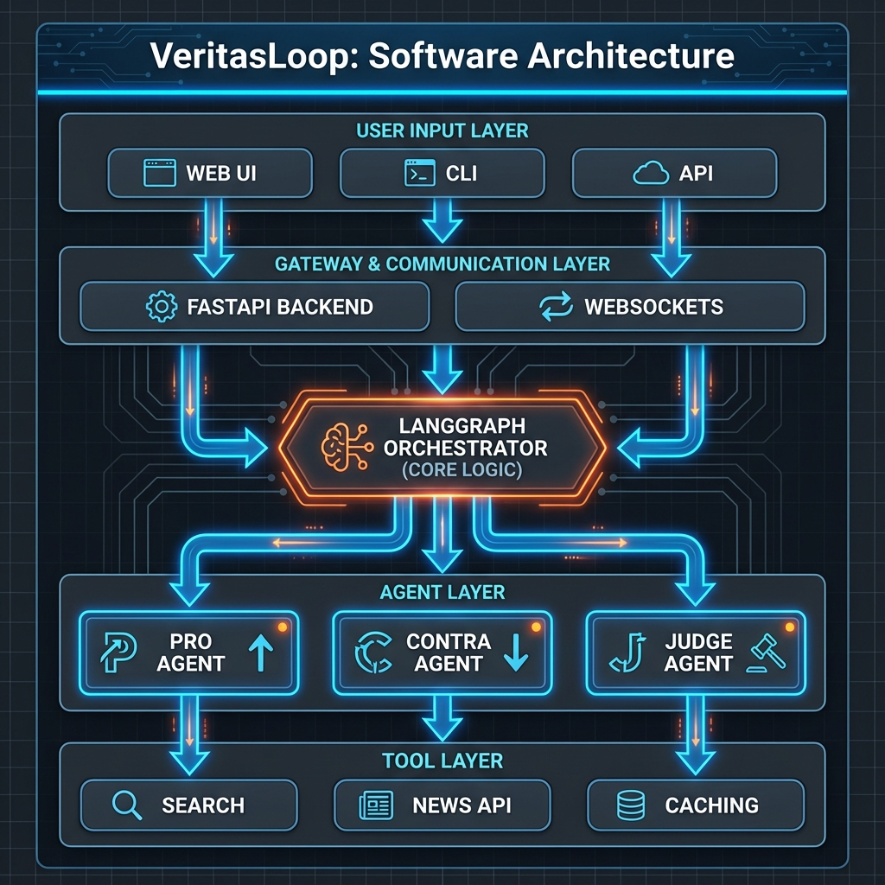

# Architecture Overview

Detailed technical architecture of the VeritasLoop multi-agent system.

## System Overview



VeritasLoop implements an adversarial multi-agent system using LangGraph for state orchestration. The system simulates a courtroom debate where:

- **PRO Agent** defends claims using authoritative sources
- **CONTRA Agent** challenges claims and identifies contradictions
- **JUDGE Agent** analyzes the debate and delivers a structured verdict

## Core Components

### 1. LangGraph State Machine

The debate flow is orchestrated through a LangGraph state machine:

```python
GraphState = TypedDict({
    "claim": Optional[Claim],                    # Extracted structured claim
    "messages": List[DebateMessage],             # Append-only debate history
    "pro_sources": List[Source],                 # PRO agent's sources
    "contra_sources": List[Source],              # CONTRA agent's sources
    "round_count": int,                          # Current debate round (0-3)
    "verdict": Optional[dict]                    # Final verdict from JUDGE
})
```

**Workflow Nodes:**

1. **`extract`**: Extract core claim and entities using LLM
2. **`pro_research`**: PRO agent initial research (parallel)
3. **`contra_research`**: CONTRA agent initial research (parallel)
4. **`debate`**: Debate round loop (CONTRA rebuttal → PRO defense)
5. **`judge`**: Final verdict generation with structured output

**Conditional Logic:**
- After `debate` node, `should_continue()` checks if `round_count >= 3`
- If yes → route to `judge` for final verdict
- If no → loop back to `debate` for another round

### 2. Agent Specifications

#### PRO Agent (Institutional Analyst)

**Role**: Defend the claim using authoritative evidence

**Characteristics:**
- **Personality**: Formal, data-driven, conservative
- **Search Strategy**: `"institutional"` - prioritizes `.gov`, `.edu`, official press releases, major news agencies
- **Message Types**: `ARGUMENT` (initial), `DEFENSE` (rebuttal)
- **Confidence**: Returns fixed 85% (placeholder for future LLM-based extraction)

**Implementation**: [`src/agents/pro_agent.py`](../src/agents/pro_agent.py)

#### CONTRA Agent (Skeptical Investigator)

**Role**: Challenge the claim, find contradictions and missing context

**Characteristics:**
- **Personality**: Critical, detail-oriented, context-aware
- **Search Strategies**:
  - `"fact_check_first"`: Prioritizes fact-check databases (Snopes, Bufale.it, etc.)
  - `"web_deep_dive"`: Broad web search for contradictions
- **Special Features**: Enhanced reliability detection for fact-check domains
- **Message Types**: `ARGUMENT` (initial), `REBUTTAL` (response)
- **Confidence**: Dynamic (70% with sources, 30% without)

**Implementation**: [`src/agents/contra_agent.py`](../src/agents/contra_agent.py)

#### JUDGE Agent (Impartial Evaluator)

**Role**: Analyze complete debate and deliver structured verdict

**Process:**
1. Review full debate transcript (all rounds)
2. Evaluate source quality and reliability
3. Identify consensus facts and disputed points
4. Assess logical coherence and fallacies
5. Generate structured verdict with JSON schema validation

**Output**: `Verdict` object with metadata (timing, rounds, source counts)

**Implementation**: [`src/agents/judge_agent.py`](../src/agents/judge_agent.py)

### 3. Data Models

All data structures use **Pydantic** for validation and type safety:

```python
# Core Models (src/models/schemas.py)
class Claim(BaseModel):
    id: UUID
    raw_input: str
    core_claim: str
    entities: Entities  # people, places, dates, organizations
    category: ClaimCategory  # politics, health, economy, science, other

class Source(BaseModel):
    url: HttpUrl
    title: str
    snippet: str
    reliability: Reliability  # high, medium, low
    timestamp: Optional[datetime]
    agent: Optional[AgentType]
    relevance_score: Optional[float]

class DebateMessage(BaseModel):
    round: int
    agent: AgentType  # PRO, CONTRA, JUDGE
    message_type: MessageType  # argument, rebuttal, defense
    content: str
    sources: List[Source]
    confidence: float  # 0-100

class Verdict(BaseModel):
    verdict: VerdictType  # VERO, FALSO, etc.
    confidence_score: float  # 0-100
    summary: str
    analysis: VerdictAnalysis
    sources_used: List[Source]
    metadata: VerdictMetadata
```

## Tools & Services

### 1. Search Tools

**Primary**: Brave Search API
- High-quality web search
- 2000 free queries/month
- Supports site filtering for institutional search

**Fallback**: DuckDuckGo (Scraping)
- Used when Brave quota exceeded
- No API key required
- Lower quality results

**Implementation**: [`src/tools/search_tools.py`](../src/tools/search_tools.py)

### 2. Content Extraction

**Library**: newspaper3k + BeautifulSoup
- Extracts article title, text, authors
- Handles various news site formats
- Removes ads and navigation

**Reliability Assessment**:
- **High**: `.gov`, `.edu`, major news agencies, fact-checkers
- **Medium**: Regional news, established blogs
- **Low**: Unknown domains, personal sites

**Implementation**: [`src/tools/content_tools.py`](../src/tools/content_tools.py)

### 3. News APIs

**NewsAPI**:
- News aggregation from 80,000+ sources
- Supports date filtering and keyword search
- 100 free requests/day

**Reddit API (PRAW)**:
- Social sentiment analysis
- Subreddit filtering
- Community discussions

**Implementations**:
- [`src/tools/news_api.py`](../src/tools/news_api.py)
- [`src/tools/reddit_api.py`](../src/tools/reddit_api.py)

### 4. Caching System

The **ToolManager** ([`src/utils/tool_manager.py`](../src/utils/tool_manager.py)) provides intelligent caching:

- **Search Cache**: Query string → Results (TTL: 3600s)
- **URL Cache**: URL → Extracted content (TTL: 3600s)
- **Metrics Tracking**: Hit/miss ratios, performance monitoring

**Benefits:**
- Reduces redundant API calls (saves costs)
- Improves response time (faster verification)
- Stays within API rate limits
- Decreases token usage (less LLM processing)

## Workflow Sequence

```
┌─────────────────────────────────────────────────────────────────┐
│ 1. INPUT PROCESSING                                             │
│    User submits claim (text or URL)                             │
│    ↓                                                            │
│    Extract core claim + entities (LLM)                          │
│    ↓                                                            │
│    Classify claim category (politics, health, etc.)             │
└─────────────────────────────────────────────────────────────────┘
                              ↓
┌─────────────────────────────────────────────────────────────────┐
│ 2. PARALLEL RESEARCH                                            │
│    ┌──────────────────┐         ┌──────────────────┐           │
│    │  PRO RESEARCH    │         │ CONTRA RESEARCH  │           │
│    ├──────────────────┤         ├──────────────────┤           │
│    │ • Institutional  │         │ • Fact-check     │           │
│    │   search         │         │   databases      │           │
│    │ • .gov, .edu     │         │ • Web deep dive  │           │
│    │ • Major news     │         │ • Contradiction  │           │
│    │ • Generate PRO   │         │   search         │           │
│    │   argument       │         │ • Generate       │           │
│    │                  │         │   CONTRA arg     │           │
│    └──────────────────┘         └──────────────────┘           │
└─────────────────────────────────────────────────────────────────┘
                              ↓
┌─────────────────────────────────────────────────────────────────┐
│ 3. DEBATE ROUNDS (up to 3 iterations)                           │
│    ┌───────────────────────────────────────────┐               │
│    │ Round N:                                  │               │
│    │   1. CONTRA rebuttal (challenges PRO)     │               │
│    │   2. PRO defense (responds to CONTRA)     │               │
│    │   3. Update round_count                   │               │
│    │   4. Check if round_count >= 3            │               │
│    │      • Yes → Proceed to JUDGE             │               │
│    │      • No → Continue debate               │               │
│    └───────────────────────────────────────────┘               │
└─────────────────────────────────────────────────────────────────┘
                              ↓
┌─────────────────────────────────────────────────────────────────┐
│ 4. JUDGE EVALUATION                                             │
│    • Analyze full debate transcript                             │
│    • Evaluate source quality                                    │
│    • Identify consensus vs disputed points                      │
│    • Assess logical coherence                                   │
│    • Generate structured verdict                                │
│    • Return: verdict type, confidence, analysis, sources        │
└─────────────────────────────────────────────────────────────────┘
```

## Design Patterns

### 1. State Management
- **Pattern**: Event Sourcing
- **Implementation**: Append-only message list in GraphState
- **Benefits**: Complete audit trail, easy debugging, reproducible results

### 2. Agent Coordination
- **Pattern**: Orchestration (not choreography)
- **Implementation**: LangGraph controls agent execution order
- **Benefits**: Centralized logic, easier to modify workflow

### 3. Parallel Execution
- **Pattern**: Fork-Join
- **Implementation**: PRO and CONTRA research in parallel
- **Benefits**: Faster total verification time

### 4. Caching Strategy
- **Pattern**: Cache-Aside
- **Implementation**: Check cache → miss → fetch → update cache
- **Benefits**: Simple, effective, handles cache failures gracefully

### 5. Error Handling
- **Pattern**: Graceful Degradation
- **Implementation**: Brave API → DuckDuckGo fallback
- **Benefits**: System continues working despite API failures

## Observability

### Phoenix Integration

**What**: Arize Phoenix - 100% local, open-source observability tool

**Features**:
- Visual trace viewer for agent interactions
- LLM prompt and response inspection
- Tool call monitoring
- Performance metrics and latency analysis
- Multi-agent conversation flows

**Storage**: Persistent SQLite database at `data/phoenix/traces.db`

**Access**: Web UI at http://localhost:6006

**Implementation**: Automatic instrumentation via OpenInference

See [LOGGING.md](LOGGING.md) for detailed logging documentation.

## Security Considerations

### API Key Management
- All keys stored in environment variables
- Never committed to version control
- `.env.example` template provided

### Input Validation
- Pydantic models validate all data structures
- URL validation for fetched content
- HTML sanitization in content extraction

### Rate Limiting
- Cache prevents redundant API calls
- Respect external API limits
- Exponential backoff on failures (future enhancement)

### Data Privacy
- No user data stored permanently
- Phoenix traces stored locally only
- Cache cleared after TTL expiration

## Scalability Considerations

### Current Limitations
- Single-threaded processing (one verification at a time)
- In-memory cache (not shared across instances)
- Synchronous LLM calls

### Future Enhancements
- **Async Processing**: Use FastAPI background tasks
- **Distributed Cache**: Redis for multi-instance deployments
- **Parallel LLM Calls**: Async Anthropic/OpenAI clients
- **Database Storage**: Persistent verdict storage
- **Queue System**: Celery for background verification jobs

## Testing Strategy

### Unit Tests
- Individual agent behavior
- Tool functionality (search, content extraction)
- Data model validation
- Cache operations

### Integration Tests
- Full pipeline execution
- Agent interaction flows
- LangGraph state transitions

### Test Coverage
- Target: >80% code coverage
- Focus: Critical paths and error handling

**Test Location**: [`tests/`](../tests/)

## Related Documentation

- [React UI Architecture](REACT_UI.md) - Frontend architecture details
- [Development Guide](DEVELOPMENT.md) - Contributing guidelines
- [Deployment Guide](DEPLOYMENT.md) - Production deployment
